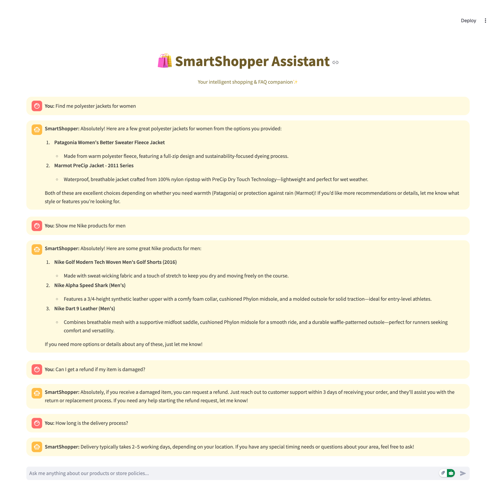

<p align="center">
  
</p>


<div align="center">

# 🛍️ **SmartShopper AI Assistant**
### Personalized Product & FAQ Chatbot


> 🚀 “An intelligent shopping & FAQ companion built with Haystack, MongoDB Atlas, and GPT-4.1.”

</div>

---

## 🌟 **Overview**

**SmartShopper AI** adalah asisten belanja pintar yang bisa:
- Menjawab pertanyaan tentang **produk** (harga, bahan, kategori, rekomendasi).
- Menjawab **FAQ umum** (refund, delivery, pembayaran, cara beli).
- Mengingat konteks percakapan selama sesi.
- Menampilkan antarmuka web yang elegan berwarna **gold pastel** agar nyaman dilihat.

Proyek ini dibangun menggunakan **Haystack RAG pipeline**, **MongoDB Atlas**, dan **Streamlit**.

---

## 🎯 **Tujuan Proyek**

- Menambahkan **Tools “Common Information”** untuk pertanyaan umum (FAQ).  
- Mengatur **flow routing otomatis** antara Product dan FAQ.  
- Menggunakan **MongoDB Atlas** sebagai document store berbasis embedding.  
- Membuat tampilan **chat interaktif** menggunakan Streamlit.

---

## 🧱 **Struktur Folder**
```
Farhan SmartShopper/
│
├── .env
├── data/
│ ├── datasets.pkl # Dataset produk
│ └── common_info.csv # Dataset FAQ
│
├── process/
│ ├── store_data.ipynb # Simpan produk ke MongoDB
│ ├── retriever.ipynb # Ambil produk dari MongoDB
│ ├── generator.ipynb # Generator rekomendasi produk
│ ├── generator_filter.ipynb # Buat JSON filter otomatis
│ ├── chat_memory.ipynb # Memory chat produk
│ ├── shop_recommendation.ipynb # Agent utama product
│ ├── common_info.ipynb # Simpan FAQ ke MongoDB
│ ├── common_retriever.ipynb # Retrieve FAQ
│ ├── common_chat_memory.ipynb # Chatbot FAQ
│
├── website/
│ ├── website.py # Streamlit App utama
│ ├── template.py
│ └── init.py
│
├── requirements.txt
└── README.md
```

---

## ⚙️ **Teknologi yang Digunakan**

| Komponen | Fungsi | Library |
|-----------|---------|----------|
| **RAG Framework** | Pipeline retrieval + generation | `haystack-ai` |
| **Database** | Vector & text search | `mongodb-atlas-haystack`, `pymongo` |
| **LLM Chat** | Generator GPT-4.1 | `OpenAIChatGenerator` |
| **Embeddings** | Vectorize teks | `sentence-transformers/all-mpnet-base-v2` |
| **Frontend** | Chat web UI | `streamlit` |
| **Environment** | API keys management | `python-dotenv` |

---

## 🧩 **Cara Kerja Sistem**

### 1. Data Storing (MongoDB Atlas)
- Dataset produk dan FAQ diubah jadi `Document()`.
- Masing-masing dikirim ke koleksi:
  - `depato_store.products`
  - `depato_store.common_information`
- Vektor embedding dibuat dengan model:
    
    `sentence-transformers/all-mpnet-base-v2`


### 2. Retrieval & Generation
- Query user → diubah jadi embedding → cari di MongoDB Atlas.
- Hasil dokumen → digabung ke dalam prompt.
- GPT-4.1 → menghasilkan jawaban natural dan relevan.

### 3. Routing Otomatis
| Jenis Pertanyaan | Pipeline Aktif |
|------------------|----------------|
| Produk (buy, price, color, cotton, brand, dll) | 🧢 `product_pipeline` |
| FAQ (refund, delivery, payment, order, support) | 📦 `common_pipeline` |

### 4. Web Interface
- Dibuat dengan Streamlit.
- Warna lembut kuning emas.
- Riwayat chat disimpan di `st.session_state`.

---

## 💬 **Contoh Percakapan**

👤 You: Find me polyester jackets for women   
🤖 SmartShopper: Sure! Here are some great polyester jackets for women...

👤 You: How long is the delivery process?   
🤖 SmartShopper: Delivery usually takes 2–5 working days depending on your location.

👤 You: Can I get a refund if my item is damaged?   
🤖 SmartShopper: Absolutely! You can request a refund within 3 days of receiving your item.


---

## 🧪 **Cara Menjalankan Proyek**

### 1. Clone Repository
```bash
git clone https://github.com/mhdfarhanali/SmartShopper-AI.git
cd SmartShopper-AI
```
### 2. Buat Virtual Environment
```python -m venv .venv
source .venv/bin/activate   # (Mac)
# atau
.venv\Scripts\activate      # (Windows)
```
### 3. Install Dependencies
```bash
pip install --no-cache-dir -r requirements.txt
```

### 4. Buat File .env
Isi dengan kredensialmu:

```bash
OPENAI_API_KEY=your_openai_api_key
MONGO_CONNECTION_STRING=your_mongodb_atlas_uri
```

### 5. Jalankan Web App
```bash
cd website
streamlit run website.py
```

### requirements.txt
```bash
haystack-ai==2.15.2
mongodb-atlas-haystack==3.3.0
sentence-transformers==5.0.0
pandas==2.3.1
pymongo==4.13.2
streamlit==1.47.1
python-dotenv==1.1.1
ipykernel==6.29.5
```

## Penjelasan Singkat Storing Process

1. Dataset produk (`datasets.pkl`) dan FAQ (`common_info.csv`) dibaca dengan pandas.

2. Setiap baris dikonversi menjadi objek `Document()`:
```
doc = Document(content=row["title"], meta={"brand": row["brand"], "price": row["price"]})
```
3. Model embedding (`all-mpnet-base-v2`) mengubah teks jadi vektor.

4. Dokumen disimpan ke MongoDB Atlas:
```
document_store.write_documents(embedded_docs)
```

5. Index `vector_index` & `vector_index_common` digunakan untuk pencarian cepat.


#### 👨‍💻 Dibuat oleh

##### Muhammad Farhan Ali
##### 🎓 Electrical Engineering → AI/ML Engineer Journey

[](https://www.linkedin.com/in/mhdfarhanali)